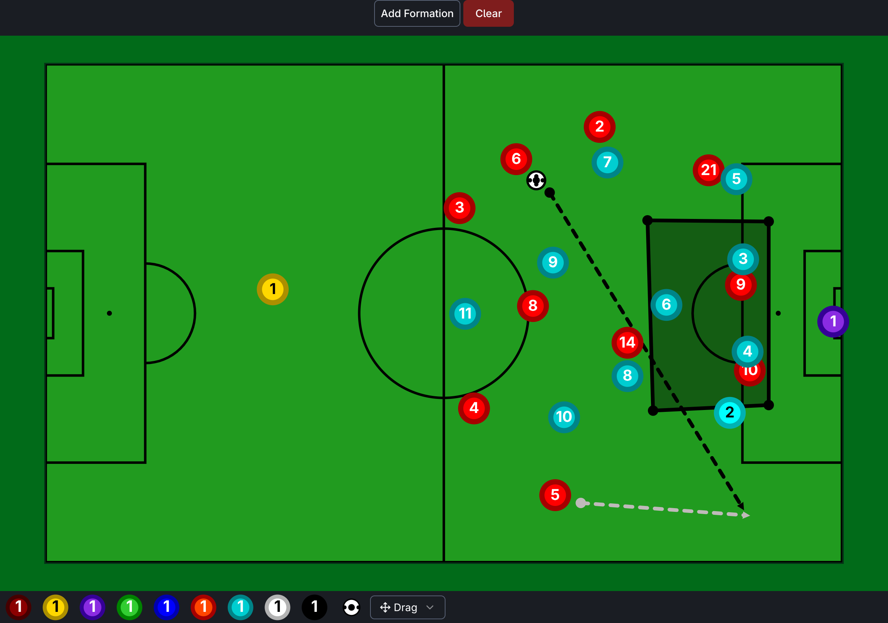

# ⚽ Ultimate Tactics – Football Tactical Board  

### Yoooo 👋  
This my project — **The Ultimate Tactics**  

This project is a **Football Tactical Board** — designed to bring your tactical ideas to life.  
Whether you want to draw **attacking runs**, set up **defensive shapes**, or experiment with **player rotations**, the board gives you a **simple yet powerful way** to plan and visualize strategies.  

It’s not just about placing players — it’s about **shaping the game the way you imagine it**.  
From grassroots training sessions to analyzing professional-level matches, this board is built to **adapt to your style of thinking**.  

---



---

## 🚀 Project Setup  

Follow these simple steps to run the project locally:  

### 1️⃣ Clone the Repository  
```bash
git clone https://github.com/your-username/ultimate-tactics.git
cd ultimate-tactics
```

### 2️⃣ Install Dependencies  
```bash
npm install
```

### 3️⃣ Run the Development Server  
```bash
npm run dev
```

Then open the URL in your browser (usually `http://localhost:5173`) and you’re good to go! 🎉  

---

## 🔮 What’s Next?  

I’m just getting started — and here’s what’s coming:  

🔥 **Relive the Match**  
Instantly jump back to iconic classic games and explore their real formations with a single click.  
No need to search, no hassle — just pure **tactical nostalgia** at your fingertips.  

🤖 **The Ultimate Tactics Backend**  
- Save your progress
- Live connect
- Share and collaborate on strategies **instantly**  

This board isn’t just about the present — it’s about shaping the **future of football tactics**.  

---
